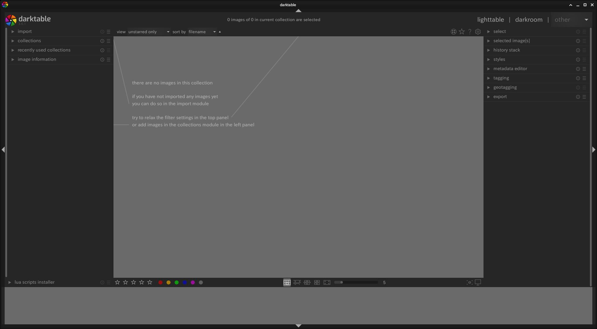
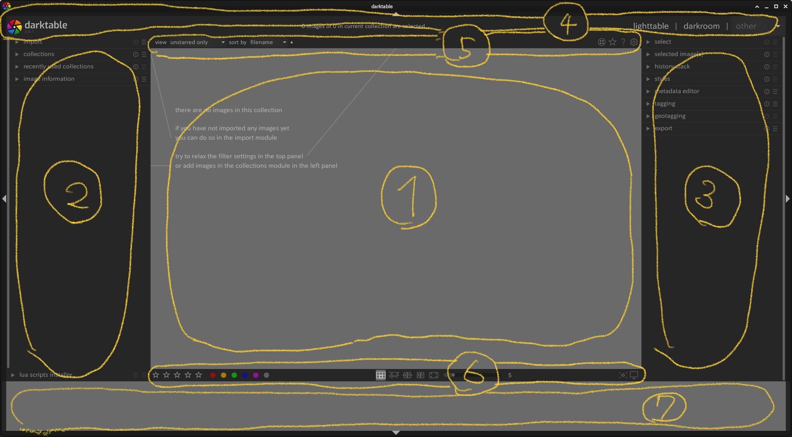
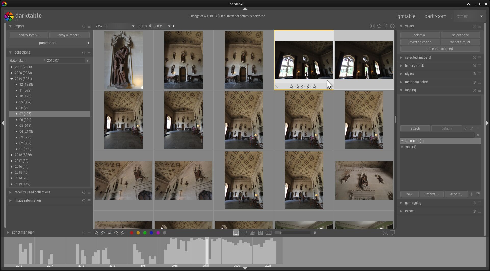
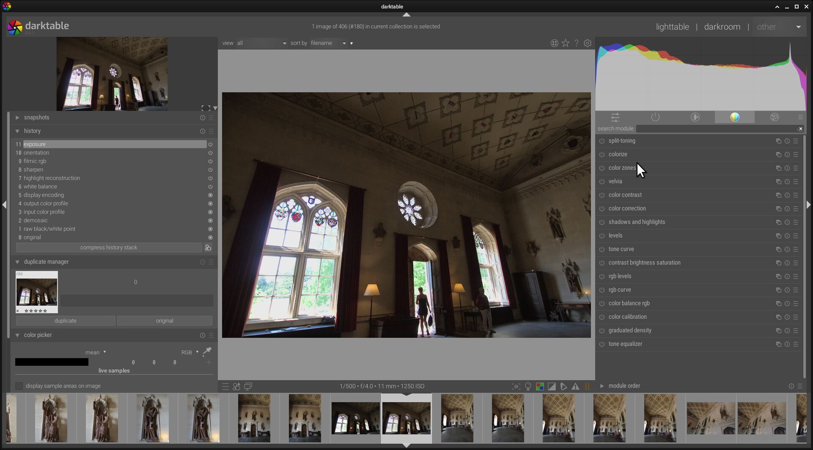
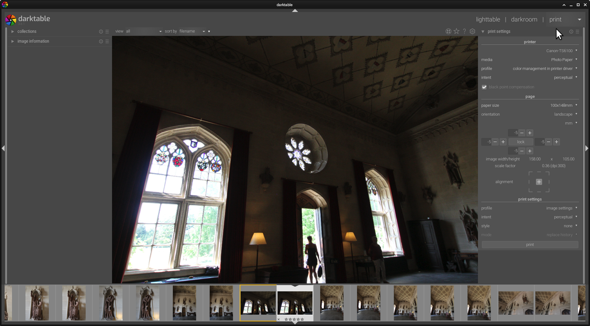

Let's Darktable!
# Preface
はじめまして趣味で時々カメラを嗜むDaiです。デジタルカメラといえば某メーカのソフトが一般的だと思いますが、アマチュアもアマチュア、デジタル一眼を持ってるだけに近い素人しにしてみたらプロ向けのソフトはあまりにも効果で手が出ませんよね。いままではCANONのデジタル一眼についてくる標準ソフトを使って画像加工をしていましたが、iMacも古くなり、僕のようにメインPCがLinuxユーザにしてみるとメーカ標準ソフトは対応していませんし、困っていました。そこでLinuxでも使える写真加工ソフトがないかと調べていたらなんとオープンソースであるじゃないですか！Darktable。しかしなかなか日本語の解説がないので、英語版を見ながら使えるようになりたいと思っていますので、その過程でわかったことをまとめてGitHubで公開してみようと思いました。素人なので画像加工などに関しては現場で使えるようなところまで触れられるとは思いませんが、理解したことをまとめていこうと思います。基本は英語のマニュアルを参考に、自分で試したことなども書いて行こうと思います。現在は2021年12月3.6を利用しています。バージョンアップの対応はありません(^^;)。OSもLinuxをUBUNTU系が対象になると思います。自分で出来る範囲を無理なく作っていきたいと思います。基本日本語です。英語版は当然ありません。しばらくは工事中と思いますが、少しづつまとめていきたいと思います。これで画像加工に興味を持っていただければ嬉しいですし、自分で撮った写真の可能性をDarkroomで見つけてみませんか？

# 全体の解説
## Darktableのインストール
Ubuntu Studioには標準でDarktableはインストールされているが、バージョンがふるい。たしか日本語バージョンが含まれていました。今回は現在の安定版の最新3.6を導入するので、古いバージョンのDarktableはアンインストールします。インストールは通常通り  
```bash:インストール
sudo apt install darktable
```

でインストールが行われます。パッケージ等のアップグレードやアップデートは行った上で実行してください。

参考[インストーラー](https://www.darktable.org/install/)  


## さぁDarktableを起動してみましょう
Darktableをインストールしたらやっぱり起動するのがアマチュア道です。LinuxであればTerminalを開いてdarktableと打ち込めば起動する事ができます。通常のアプリケーションですからToolBarやアプリケーションリストにもdarkroomのアイコンを見つけられれば、ダブルクリックで起動する事が出来るはずです。    
  


## 画面の構成　(v3.6)
  
各所の名前と説明  

|番号|名前|概要|
|:---|:---|:---|
|1|センターエリア<br>Center Area|Lighttabkleでのイメージの一覧やDarkroomでの画像の編集する作業エリア|
|2|左パネル<br>Left Panel|フィルムや写真の情報が表示される|
|3|右パネル<br>Right Panel|画像加工などの機能はこのパネルに集約される|
|4|上のバナー<br>Top Banner|ヒントやメッセージの表示とViewの切替|
|5|上のパネル<br>Top Panel|設定やショートカット|
|6|下のパネル<br>Bottom Panel|ショートカット|
|7|フィルム/タイムラインパネル<br>Film strip/Time line panel|Lighttableの簡易表示|

各パネルは▲▼◀▶で端っこに折りたたむ事ができます。  
参考 [マニュアル v3.6](https://docs.darktable.org/usermanual/3.6/overview/user-interface/screen-layout/)

## View
Darktableには6つのViewがあり、これらを切り替えて使います。  
  

**Lighttable** これはFilmstripと言われる画像の一覧をみる画面です。Filmstripと言っても実際はフォルダーになります。基本はImportして取り込んだ単位ごとにこのFilmstrapが作られますが、すでに存在する画像が入ったフォルダーをFilmstripとすることもできます。この画面では、画像の取り込み、画像の大まかな選択や分類、削除などができます。ピンぼけしている画像の削除、気に入った画像のレートを上げたり、家族が写っている画像にマークをつけたり、自分の好きなタグをつけたりすることができます。  
  

**Darkroom**  ここが画像加工をするところです。日本語に訳すと暗室となります。フィルム写真の場合、フィルムの画像を感光紙に焼き付ける部屋ですね。まさにここで撮った写真を作り上げていく場所になります。  
  

**Map** これは画像に含まれるGPS情報を読みとって地図上にサムネイルを表示するものです。  
  

**Print**　これは読んで字のごとく印刷です。  
  

**Slidshow**  こちらもスライドショーです。まぁあまり使いませんね。  

**Tethering**  テザリングとはカメラをDarktableから操作するものです。プロのスタジオカメラマンなら欲しい機能ではないでしょうか。libgphoto2のライブラリーを利用してカメラに接続をしてコントロールを行います。僕のCanon 7Dも一応対応しているはずですが、認識できていない状況です。(2021年12月)こちらは後で治せるか調べてみたいものです。直したところで僕には使いみちはなさそうですが。  


## ワークフロー

## Darktableに関係するファイル


# Refence
[Darktabke web page](https://www.darktable.org/)  
[Darktable 3.6 user manual](https://docs.darktable.org/usermanual/3.6/)  
[Darktable Git Hub](https://github.com/darktable-org)  

# PostScript
[My Profile](profile.md)
